<picture>
  <source
    srcset="./assets/stats-dark.svg"
    media="(prefers-color-scheme: dark)"
  />
  <source
    srcset="./assets/stats-light.svg"
    media="(prefers-color-scheme: light), (prefers-color-scheme: no-preference)"
  />
  
</picture>

<picture>
  <source
    srcset="./assets/top-langs-dark.svg"
    media="(prefers-color-scheme: dark)"
  />
  <source
    srcset="./assets/top-langs-light.svg"
    media="(prefers-color-scheme: light), (prefers-color-scheme: no-preference)"
  />
  
</picture>

## 📚 Latest Blog Posts

<!-- BLOG-POST-LIST:START -->
- [Book summary: Dive into Design Patterns](https://www.sglavoie.com/posts/2024/03/09/book-summary-dive-into-design-patterns/)
- [Book summary: Learning Go – An Idiomatic Approach to Real-World Go Programming](https://www.sglavoie.com/posts/2023/10/20/book-summary-learning-go-idiomatic-approach-real-world-go-programming/)
- [First Steps with RxJS](https://www.sglavoie.com/posts/2023/10/01/first-steps-with-rxjs/)
- [Book summary: Refactoring UI](https://www.sglavoie.com/posts/2023/09/09/book-summary-refactoring-ui/)
- [Building a task planner with React Native: an academic journey](https://www.sglavoie.com/posts/2023/07/30/building-task-planner-react-native/)
<!-- BLOG-POST-LIST:END -->

[ Read more][website] &nbsp;&nbsp;&nbsp;&nbsp; [ RSS feed][rss]

## 🔌 Let's connect

[][website]
[][twitter]
[][linkedin]
[][stackoverflow]
[][hackerrank]

  

## :computer: Recent Activity

<!--START_SECTION:activity-->
1. 🔒 Closed issue [#97](https://github.com/datopian/gift-publisher/issues/97) in [datopian/gift-publisher](https://github.com/datopian/gift-publisher)
2. 🔒 Closed issue [#203](https://github.com/datopian/gift-portal/issues/203) in [datopian/gift-portal](https://github.com/datopian/gift-portal)
3. 🔒 Closed issue [#202](https://github.com/datopian/gift-portal/issues/202) in [datopian/gift-portal](https://github.com/datopian/gift-portal)
4. 🔒 Closed issue [#45](https://github.com/datopian/gift-publisher/issues/45) in [datopian/gift-publisher](https://github.com/datopian/gift-publisher)
5. 🔒 Closed issue [#41](https://github.com/datopian/ckan-client-js/issues/41) in [datopian/ckan-client-js](https://github.com/datopian/ckan-client-js)
<!--END_SECTION:activity-->

[hackerrank]: https://www.hackerrank.com/sglavoie
[rss]: https://www.sglavoie.com/feeds/sglavoie.rss.xml
[website]: https://www.sglavoie.com
[twitter]: https://twitter.com/sgdlavoie
[linkedin]: https://www.linkedin.com/in/sglavoie
[stackoverflow]: https://stackoverflow.com/users/8787680/s%C3%A9bastien-lavoie
